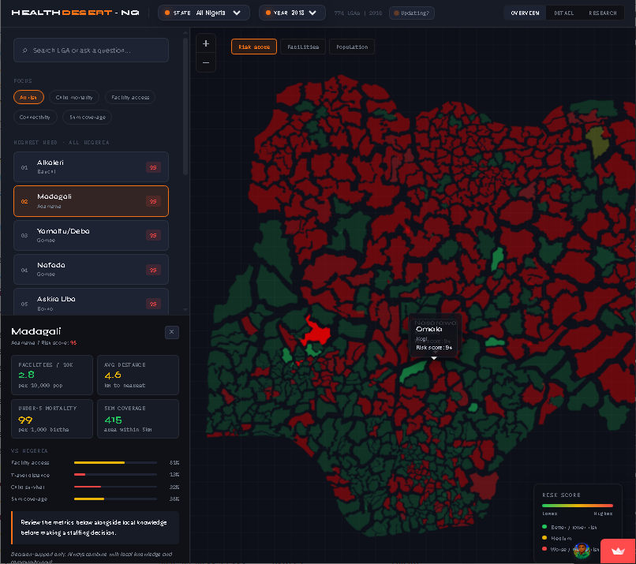
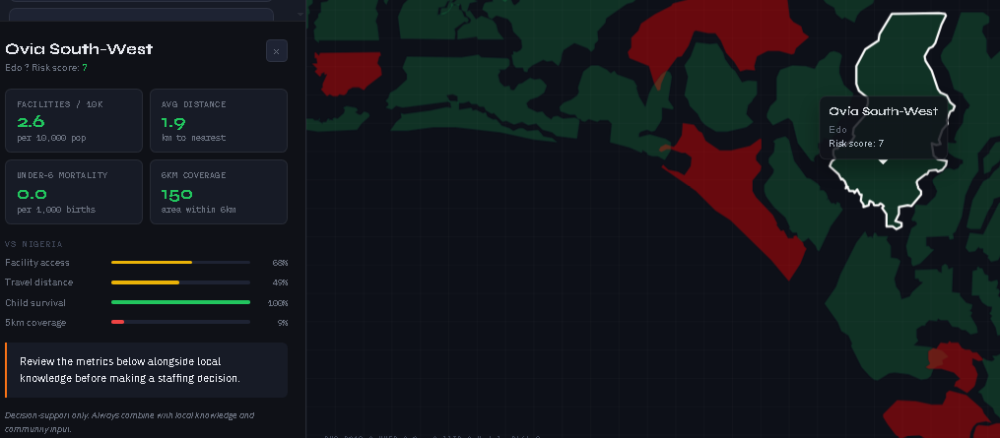
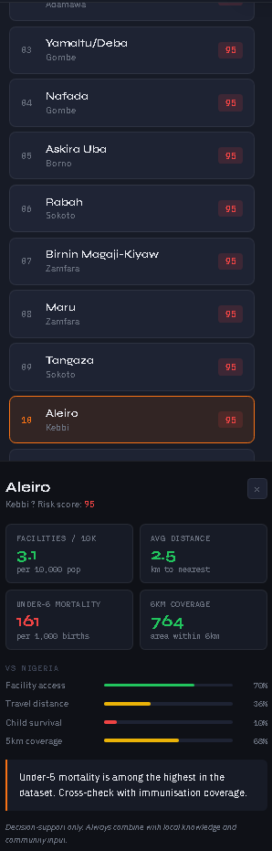

# Health Desert Scorer (Nigeria)

A simple map tool to help you spot Nigerian LGAs where people may face **higher barriers to healthcare access**.

🌐 **Live app:** https://bashir-healthdesert.streamlit.app/

---

## Why I made this
I built this because many poor health outcomes are not only medical problems — they are also **distance, facility, and connectivity** problems.

This project helps surface where access constraints may be strongest, so decisions about outreach, staffing, and investment can start from evidence.

---

## Who can use this
- **Curious Nigerians**: understand health access patterns in your state/LGA.
- **Nurses & frontline coordinators**: identify communities that may need outreach first.
- **Policy teams & government**: prioritize limited resources more transparently.
- **NGOs & donors**: plan location-aware interventions.
- **Researchers & students**: explore spatial health inequality.

---

## Quick start (60 seconds)
1. Open the app: https://bashir-healthdesert.streamlit.app/
2. Select a **State** (or keep *All Nigeria*).
3. Select a **Year**.
4. Use the left panel to:
   - search an LGA,
   - switch focus (all risk, child mortality, facility access, connectivity, 5km coverage),
   - view highest-need LGAs.
5. Use map tabs (**Risk score**, **Facilities**, **Connectivity**) to explore different views.

---

## What things mean (key definitions)
- **Health desert (in this project):** an area where people are more likely to face practical barriers to care (distance, fewer facilities, weaker connectivity, and related risk signals).
- **Risk score:** a **relative planning score** (not a diagnosis) showing which LGAs may need attention sooner compared with others.
- **Facilities layer:** map view showing healthcare facility presence/distribution.
- **Connectivity layer:** map view showing mobile-network connectivity context (towers per 10k).
- **Facility access (focus):** view emphasizing likely constraints in reaching nearby care.
- **Connectivity (focus):** view emphasizing weak signal/network proxy areas that can affect care coordination.
- **5km coverage (focus):** view related to how much population/facility access is likely within a 5km distance band.
- **Highest-need list:** ranked LGAs with comparatively higher risk in the current filter.
- **LGA:** Local Government Area.

---

## How to read the map
- **Green** = relatively lower risk.
- **Yellow/Orange** = medium concern.
- **Red** = relatively higher risk / likely higher access constraints.

> Important: this is a decision-support signal for planning and prioritization. It does **not** diagnose people or replace local field knowledge.

---

## Screenshot walkthrough
A quick visual tour of the tool in action:

### 1) National overview + selected LGA context
Shows the risk map, highest-need list, and detailed card for a selected LGA.



### 2) Lower-risk example (local detail panel)
Shows how a lower-risk LGA looks in the detail panel, so users can compare extremes.



### 3) Mobile-friendly side panel view
Shows compact ranking + metrics view for smaller screens.



### 4) Facility-access focus in search workflow
Shows filtering by **Facility access** and searching within a state context.


---

## How different users can apply it
- **Layperson:** compare your LGA with nearby LGAs and ask better local health questions.
- **Nurse/PHC lead:** shortlist high-risk LGAs for outreach, ANC/PNC follow-up, or mobile clinic planning.
- **Policy official:** compare high-risk zones with current budget/program placement.
- **Researcher:** use as a hypothesis-generating layer before deeper causal analysis.

---

## Responsible use
- This is a **planning tool**, not a clinical triage system.
- Always combine with field realities: security, roads, seasonality, staffing quality, and local validation.
- Treat outputs as a **starting point**, not final truth.

---

## Run locally
```bash
./scripts/run_demo.sh
```

Manual setup:
```bash
python -m venv .venv
source .venv/bin/activate  # Windows: .venv\Scripts\Activate.ps1
pip install -r requirements.txt
python scripts/create_mock_dhs.py
python scripts/download_open_data.py
python -m src.data.build_features
make build-data
make validate-gold
streamlit run app/app.py
```

---

## Data, ethics, and limits
- Repo stores aggregated outputs only.
- Do **not** commit restricted DHS microdata or sensitive coordinates.
- `data/bronze/` holds immutable source snapshots, with sensitive raw data kept local per DHS data-use agreements.
- `data/silver/` and `data/gold/` contain validated, app-ready aggregates for reproducible demos.
- Results are exploratory and should be validated before policy commitments.

---

## Contact
If you want to collaborate or use this in a program/research workflow:

- 🌍 **www.bashir.bio**
